# 🏠 Roofing CRM Dashboard

<p align="center">

</p>

<p align="center">


</p>

---

# 📌 Project Description

Roofing CRM Dashboard is a modern, responsive CRM interface built with **React.js** and **Tailwind CSS**. It provides an organized dashboard for managing customers, projects, operations, finance, inventory, reports, analytics, documents, and company settings through an intuitive user interface.

---

# ✨ Features

- Modern Dashboard
- Responsive Layout
- Professional Sidebar Navigation
- CRM Management
- Project Management
- Operations Management
- Finance Management
- Inventory Management
- Reports & Analytics
- Document Management
- Company Settings
- Clean UI Components

---

# 📂 Modules

## 📊 Dashboard

- Dashboard Overview
- KPI Cards
- Business Summary

---

## 👥 CRM

- Leads
- Opportunities
- Customers

---

## 🏗 Projects

- Active Jobs
- Project Schedule
- Inspections
- Work Orders

---

## ⚙️ Operations

- Tasks
- Calendar
- Teams / Employees
- Subcontractors

---

## 💰 Finance

- Estimates
- Invoices
- Payments
- Expenses

---

## 📦 Inventory

- Materials
- Suppliers
- Purchase Orders

---

## 📈 Reports

- Revenue Reports
- Sales Reports
- Job Performance

---

## 📊 Analytics

- Business Analytics
- Pipeline Analytics

---

## 📄 Documents

- Contracts
- Photos
- Attachments

---

## ⚙️ Settings

- Company Settings
- User Management
- Roles & Permissions

---

# 🛠 Tech Stack

- React.js
- Tailwind CSS
- JavaScript (ES6+)
- Vite
- React Router
- Responsive Design

---

# 📁 Folder Structure

```text
ROOFING-CRM
│
├── public
├── screenshots
│   ├── dashboard.jpg
│   ├── leads.jpg
│   ├── customers.jpg
│   ├── active-jobs.jpg
│   ├── calendar.jpg
│   ├── invoices.jpg
│   ├── materials.jpg
│   ├── revenue-reports.jpg
│   ├── business-analytics.jpg
│   ├── contracts.jpg
│   ├── user-management.jpg
│   └── company-settings.jpg
│
├── src
│   ├── assets
│   ├── components
│   ├── layouts
│   ├── pages
│   ├── App.jsx
│   └── main.jsx
│
├── package.json
├── vite.config.js
├── README.md
└── .gitignore
```

---

# 🚀 Installation

Clone the repository

```bash
git clone https://github.com/Hassoo-000/Roofing-CRM.git
```

Navigate into the project

```bash
cd Roofing-CRM
```

Install dependencies

```bash
npm install
```

Start the development server

```bash
npm run dev
```

---

# 📸 Project Screenshots

## 📊 Dashboard

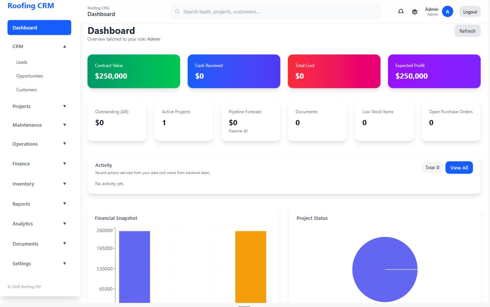

---

## 👥 CRM - Leads

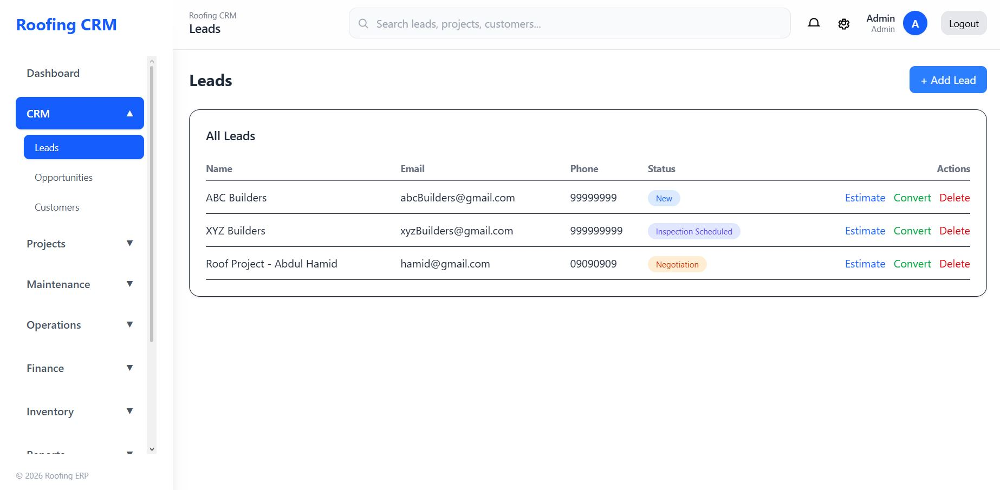

---

## 👥 CRM - Customers

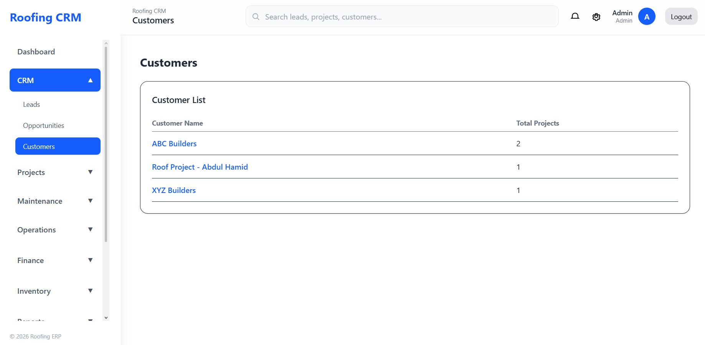

---

## 🏗 Projects - Active Jobs

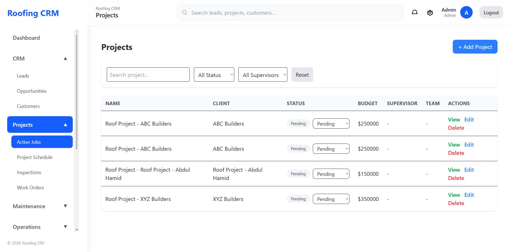

---

## ⚙️ Operations - Calendar

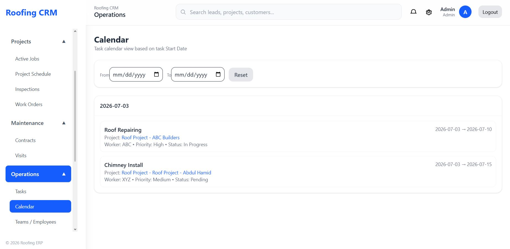

---

## 💰 Finance - Invoices

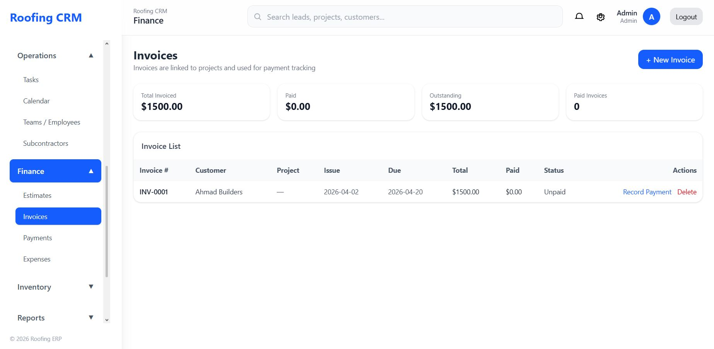

---

## 📦 Inventory - Materials

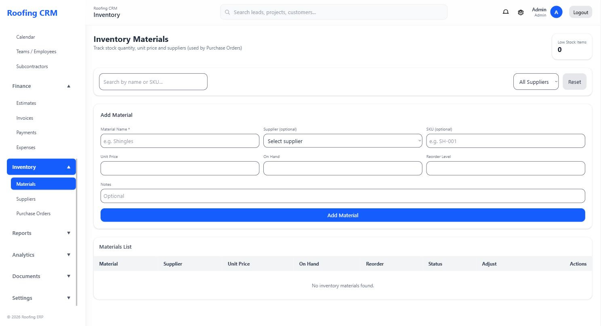

---

## 📈 Reports - Revenue Reports

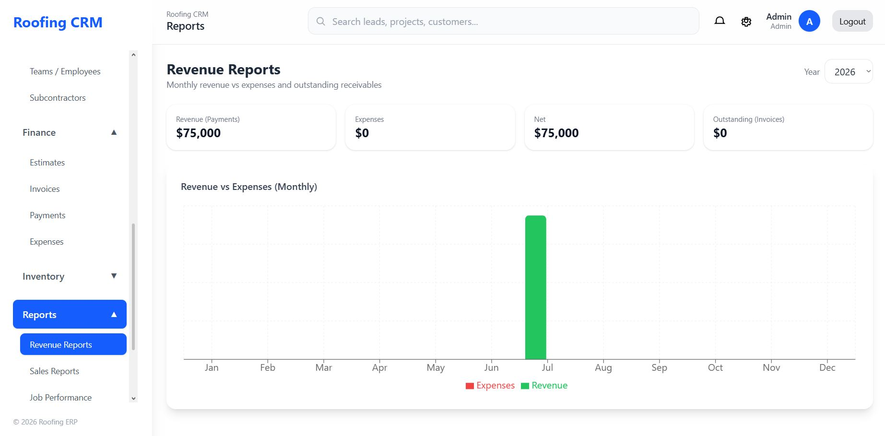

---

## 📊 Analytics - Business Analytics

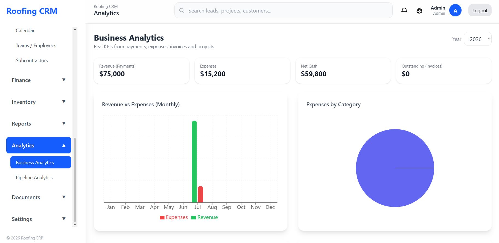

---

## 📄 Documents - Contracts

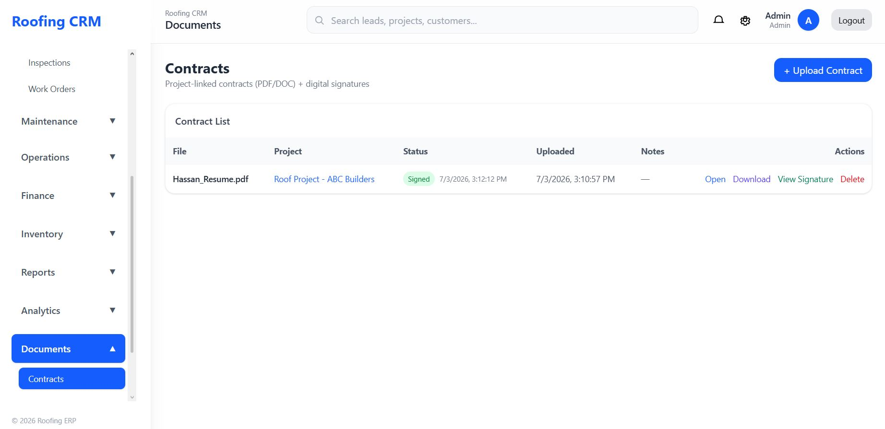

---

## ⚙️ Settings - User Management

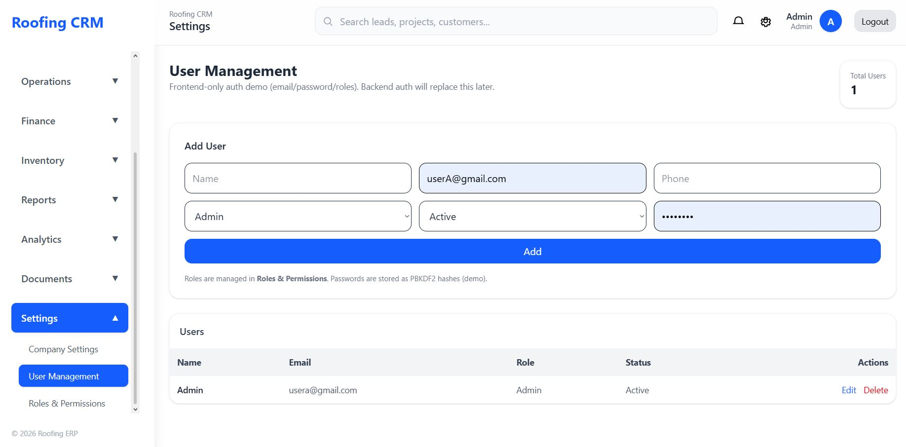

---

## ⚙️ Settings - Company Settings

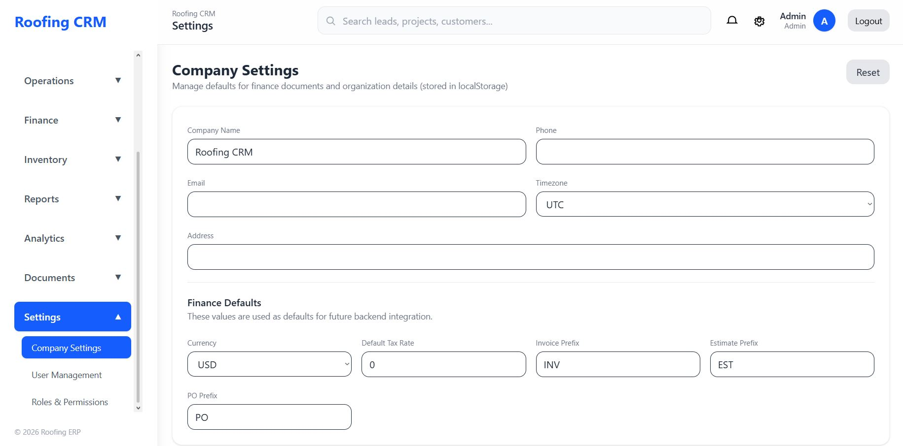

---

# 🚀 Future Improvements

- Backend Integration
- Authentication & Authorization
- Role-Based Access Control
- REST API Integration
- Charts & Data Visualization
- Real-time Notifications
- Dark Mode
- Database Integration
- Mobile Optimization
- Export Reports

---

# 👨‍💻 Author

## Muhammad Hassan

🎓 Computer Science Graduate

💻 MERN Stack Developer

🔗 **LinkedIn**

www.linkedin.com/in/muhammad-hassan-249408293

🐙 **GitHub**

https://github.com/Hassoo-000

---

⭐ **If you found this project helpful, consider giving it a star!**